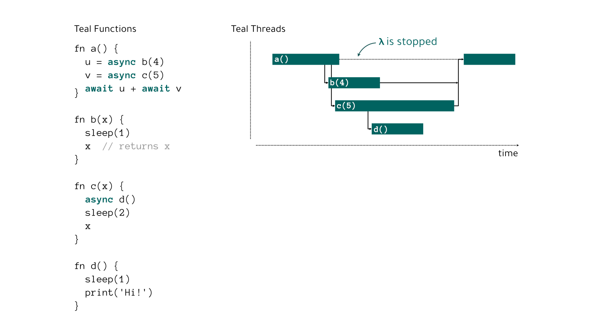

# The Teal Programming Language

 [](https://pypi.org/project/teal-lang) [](https://gitter.im/Teal-Lang/community?utm_source=badge&utm_medium=badge&utm_campaign=pr-badge)

Teal is a programming language for serverless cloud applications, designed for
passing data around between Python functions. Concurrency supported. Execution
tracing built-in.

Key features:
- Very little infrastructure, for applications of any complexity. The Teal
  runtime shares 4 Lambda functions and stores execution state in a DynamoDB
  table.
- Minimal wasted server time. When your code is waiting for another thread to
  finish, the Lambda is completely stopped.
- Simple mental models. Teal programs can be traced, profiled, and the code can
  be reviewed just like any other language. Want to see where your Python
  function is being used? Just grep your codebase.
- Local testing is first-class. Teal programs can be run locally, so you can
  test your entire workflow before deployment.

Teal runs locally or on AWS Lambda. Teal threads can be suspended while another
thread finishes. Execution data is stored in memory or in a DynamoDB table.



Documentation coming soon! For now, browse the [the examples](test/examples) or
the check out the [Teal Playground](https://www.condense9.com/playground).


## FAQ

**Why is this not a library/DSL in Python?**

When Teal threads wait on a Future, they stop completely. The Lambda function
saves the machine state and then terminates. When the Future resolves, the
resolving thread restarts any waiting threads by invoking new Lambdas to pick up
execution.

To achieve the same thing in Python, the framework would need to dump the entire
Python VM state to disk, and then reload it at a later point -- I don't know
Python internals well enough to do this, and it felt like a huge task.

**How is Teal like Go?**

Goroutines are very lightweight, while Teal `async` functions are pretty heavy --
they involve creating a new Lambda (or process, when running locally).

Teal's concurrency model is similar to Go's, but channels are not fully
implemented so data can only be sent to/from a thread at call/return points.

**Is this an infrastructure-as-code tool?**

No, Teal doesn't create or manage infrastructure. There are already great tools
to do that ([Terraform](https://www.terraform.io/),
[Pulumi](https://www.pulumi.com/), [Serverless
Framework](https://www.serverless.com/), etc). Teal requires infrastructure to
run on AWS, and you can set that up however you prefer.

Instead, Teal reduces the amount of infrastructure you need. Instead of a
distinct Lambda function for every piece of application logic, you only need the
core Teal interpreter Lambda functions.


## Getting started

**Teal is alpha quality - don't use it for mission critical things.**

```shell
$ pip install teal-lang
```

This gives you the `teal` executable.

Browse the [the examples](test/examples) to explore the syntax.

Check out an [example AWS deployment](examples/hello/serverless.yml) using the
Serverless Framework.

[Create an issue](https://github.com/condense9/teal-lang/issues) if none of this
makes sense, or you'd like help getting started.


### Teal May Not Be For You!

Teal *is* for you if:
- you want to build ETL pipelines.
- you have a repository of data processing scripts, and want to connect them
  together in the cloud.
- you insist on being able to test as much as possible locally.
- You don't have time (or inclination) to deploy and manage a full-blown
  platform (Spark, Airflow, etc).
- You're wary of Step Functions (and similar) because of vendor lock-in and cost.

Core principles guiding Teal design:
- Do the heavy-lifting in Python.
- Keep business logic out of infrastructure (no more hard-to-test logic defined
  in IaC, please).
- Workflows must be fully tested locally before deployment.


## Why Teal?

Teal is **not** Kubernetes, because it's not trying to let you easily scale
Dockerised services.

Teal is **not** containerisation, because.. well because there are no containers
here.

Teal is **not** a general-purpose programming language, because that would be
needlessly reinventing the wheel.

Teal is a very simple compiled language with only a few constructs:

1. named variables (data, functions)
2. `async`/`await` concurrency primitives 
3. Python (>=3.8) interop
4. A few basic types

Two interpreters have been implemented so far -- local and AWS Lambda, but
there's no reason Teal couldn't run on top of (for example) Kubernetes. [Issue
#8](https://github.com/condense9/teal-lang/issues/8)

**Concurrency**: Teal gives you "bare-metal concurrency" (i.e. without external
coordination) on top of AWS Lambda.

When you do `y = async f(x)`, Teal computes `f(x)` on a new Lambda instance. And
then when you do `await y`, the current Lambda function terminates, and
automatically continues when `y` is finished being computed. There's no idle
server time.

**Testing**: The local interpreter lets you test your program before deployment,
and uses Python threading for concurrency.

**Tracing and profiling**: Teal has a built-in tracer tool, so it's easy to see
where the time is going.


## Current Limitations and Roadmap

Teal is alpha quality, which means that it's not thoroughly tested, and lots of
breaking changes are planned. This is a non-exhaustive list.

### Libraries

Only one Teal program file is supported, but a module/package system is
[planned](https://github.com/condense9/teal-lang/issues/9).

### Error Handling

There's no error handling - if your function fails, you'll have to restart the
whole process manually. An exception handling system is
[planned](https://github.com/condense9/teal-lang/issues/1).

### Typing

Function inputs and outputs aren't typed. This is a limitation, and will be
fixed soon, probably using
[ProtoBufs](https://developers.google.com/protocol-buffers/) as the interface
definition language.

### Calling Arbitrary Services

Currently you can only call Teal or Python functions -- arbitrary microservices
can't be called. Before Teal v1.0 is released, this will be possible. You will
be able to call a long-running third party service (e.g. an AWS ML service) as a
normal Teal function and `await` on the result.

### Dictionary (associative map) primitives

Teal really should be able to natively manipulate JSON objects. This may happen
before v1.0.

---


## Contributing

Contributions of any form are welcome! See [CONTRIBUTING.md](CONTRIBUTING.md)

Minimum requirements to develop:
- Docker (to run local DynamoDB instance)
- Poetry (deps)

Use `scripts/run_dynamodb_local.sh` to start the database and web UI. Export the
environment variables it gives you - these are required by the Teal runtime.


## Who?

Teal is maintained by [Condense9 Ltd.](https://www.condense9.com/). Get in touch
with [ric@condense9.com](ric@condense9.com) for bespoke data engineering and
other cloud software services.

Teal started because we couldn't find any data engineering tools that were
productive and *felt* like software engineering. As an industry, we've spent
decades growing a wealth of computer science knowledge, but building data
pipelines in $IaC, or manually crafting workflow DAGs with $AutomationTool,
*just isn't software*.


## License

Apache License (Version 2.0). See [LICENSE](LICENSE) for details.
