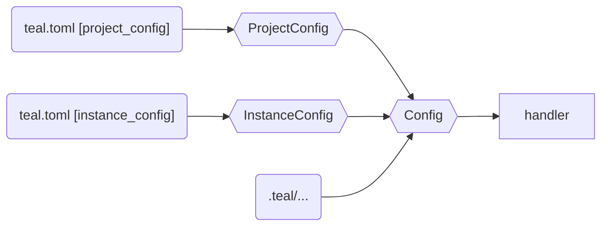

# The CLI

The CLI, in `teal_lang/cli`, does what you'd expect. Some neat libraries are
used to make things pretty.

So what happens when we run `teal service.tl`? First, the command line is
interpreted, then further configuration is read, and finally the command handler
(in this case "run") is dispatched.

## Command

[Next: Configuration](#configuration)

Relevant functions & classes:
- `__docstring__` & `dispatch` -- [teal_lang/cli/main.py][main]
- `UserResolvableError` -- [teal_lang/exceptions.py][exceptions]

The command line `teal FILE` is the "default" command -- just run the Teal file
locally.

Teal uses [docopt][docopt]. It's simple and doesn't impose many structural
constraints -- you get a dictionary that describes the command-line options. It
could be swapped out one day if really needed.

To add a CLI command or option:
- modify the `cli/main.py` module docstring
- add a branch to `dispatch` if necessary
- modify handlers as necessary

**Note**: the CLI also handles user-facing errors (exceptions of
`UserResolvableError`) and attempts to print them nicely.

Some command line arguments are particularly interesting:
- the `-c` flag, which sets the concurrency mode (Python threads by default)
- the `-s` flag, which sets the storage mode (in-memory by default)
- the `-f` flag, which sets the function to run (`main` by default)

In this case, there are no arguments, but it is possible to pass arguments on
the command line.

## Configuration

[Prev: Command](#command) \
[Next: Handler](#handler)

Relevant functions & classes:
- `load` -- [teal_lang/config.py][config]
- `Config` -- [teal_lang/config.py][config]
- `ProjectConfig` -- [teal_lang/config_classes.py][config_classes]
- `InstanceConfig` -- [teal_lang/config_classes.py][config_classes]

If a handler requires configuration (like `run` does -- the program timeout), it
looks for `teal.toml` and loads it into a set of [dataclasses][dc].

Other configuration data is stored in the `teal_data` directory (usually
`.teal`, but configurable).

## Handler

[Prev: Configuration](#configuration) \
[Next: Compilation](source-to-success-compilation.md)

Relevant functions & classes:
- `run_local` -- [teal_lang/run/local.py][local]
- `run_ddb_*` -- [teal_lang/run/dynamodb.py][dynamodb]

In this case, the `_run` handler is called. To run Teal, a few things are
needed:

Explanation:
- **Data Controller**: this is the "memory" of the Teal VM
- **Invoker**: determines how threads are run
- **Executable**: the Teal program executable

In this case, we're running the program locally, without using DynamoDB, so the
`run_local` function is used to instantiate the controller and invoker. **Note**
that the data controller holds all VM state, and so needs to know the entrypoing
function. The invoker can then run the VM, given that state.

But first, we need to compile the Executable.

<!-- --- -->

[main]: https://github.com/condense9/teal-lang/blob/master/src/teal_lang/cli/main.py
[exceptions]: https://github.com/condense9/teal-lang/blob/master/src/teal_lang/exceptions.py
[local]: https://github.com/condense9/teal-lang/blob/master/src/teal_lang/run/local.py
[dynamodb]: https://github.com/condense9/teal-lang/blob/master/src/teal_lang/run/dynamodb.py
[api]: https://github.com/condense9/teal-lang/blob/master/src/teal_lang/cloud/api.py

[docopt]: http://docopt.org/
[dc]: https://docs.python.org/3/library/dataclasses.html
