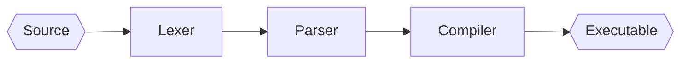
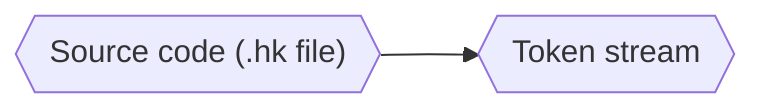
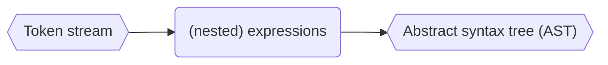
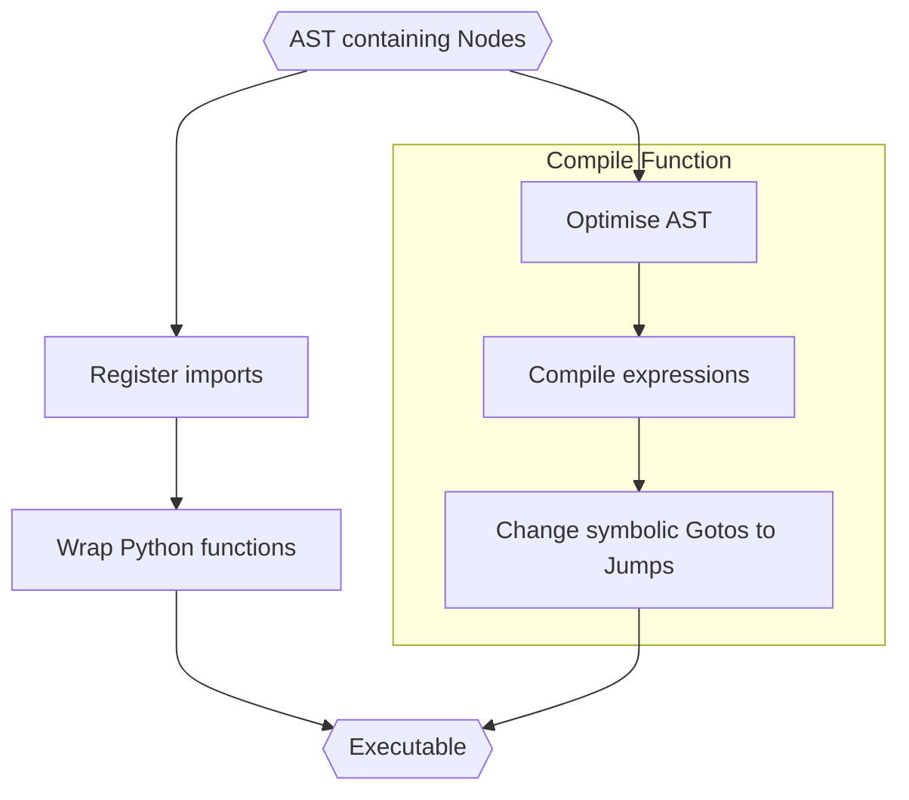

# Compilation



We'll look at each step in more detail now.


## Lex

[Next: Parse](#parse)

In this step, the Hark source code is transformed into a stream of "tokens"
representing valid pieces of syntax (e.g. numbers, identifiers, keywords).



Relevant functions & classes:
- `compile_file` -- [hark_lang/load.py][load]
- `tl_parse` -- [hark_lang/hark_parser/parser.py][parser]
- `HarkLexer` -- [hark_lang/hark_parser/parser.py][parser]

To see what the token stream looks like, load the file with the `DEBUG_LEX`
environment variable set:

```shell
$ DEBUG_LEX=1 hark service.hk

ID         : import
(          :
ID         : foo
,          :
ID         : pysrc
,          :
NUMBER     : 1
)          :
TERM       : ;
FN         : fn
ID         : bar
(          :
ID         : x
... etc
```

Note:
- each token has a "type" (e.g. `ID` -- Identifier, or `FN` -- the "define
  function" keyword)
- some tokens have a "value" (e.g. `foo`)
- punctuation is syntax (e.g. `(`)
- some literals have their own tokens (e.g. `"true"` -> `TRUE`)

The lexing is done by [Sly][sly].


## Parse

[Prev: Lex](#lex) \
[Next: Compile](#compile)

Here, the token stream is converted into a tree-like data-structure representing
valid Hark program structure.



Relevant functions & classes:
- `tl_parse` -- [hark_lang/hark_parser/parser.py][parser]
- `HarkParser` -- [hark_lang/hark_parser/parser.py][parser]
- `Node` -- [hark_lang/hark_parser/nodes.py][nodes]

> We don't have a good visualisation of the Hark AST yet :(. Make one and submit
> a PR for [Issue #14](https://github.com/condense9/hark-lang/issues/14)!

What does **valid program structure** mean? Hark programs are sequences of
"expressions". Everything is an expression, and expressions may contain other
expressions.

The AST is made up of `Node` instances, which represent expressions.

For example, the token `TRUE` is parsed as an expression (`expr`) into a Node
subclass called `N_Literal`, which holds a literal value (Python `True` in this
case).

```python
@_("TRUE")
def expr(self, p):
    return N(self, p, n.N_Literal, True)
```

*Note*: `N` is a factory function to construct a Node with debug symbols taken
from the parser.

Another example. The sequence of tokens representing an if-expression (yup, `if`
is also an `expr`) are parsed into a Node to represent it.

```python
@_("IF expr block_expr TERM rest_if")
def expr(self, p):
    return N(self, p, n.N_If, p.expr, p.block_expr, p.rest_if)
```

Here, `block_expr` and `rest_if` are parser items with rules expressed
elsewhere.

This is how a function call, e.g. `foo(x)`, is parsed:

```python
@_("ID '(' arglist ')'")
def expr(self, p):
    identifier = N(self, p, n.N_Id, p.ID)
    return N(self, p, n.N_Call, identifier, p.arglist)
```

- `ID`: `foo`
- `'('`: a literal opening bracket
- `arglist`: a parser rule to parse a list of arguments (defined elsewhere)
- `')'`: a literal closing bracket

Check the [Sly][sly] docs for more details.

**Error handling**: The parser is currently fragile - any error causes immediate
failure. A more conventional approach would be to attempt to continue and
present all errors at the end.


## Compile

[Prev: Parse](#parse)

The AST is now compiled into an Executable -- a multi-step process.



Relevant functions & classes:
- `Node` -- [hark_lang/hark_parser/nodes.py][nodes]
- `CompileToplevel` -- [hark_lang/hark_compiler/compiler.py][compiler]
- `optimise_block` -- [hark_lang/hark_compiler/compiler.py][compiler]
- `replace_gotos` -- [hark_lang/hark_compiler/compiler.py][compiler]
- `Executable` -- [hark_lang/machine/executable.py][executable]
- `Instruction` -- [hark_lang/machine/instructionset.py][instructionset] and [hark_lang/machine/instruction.py][instruction]
- `TlType` -- [hark_lang/machine/types.py][types]

> Currently, each Hark function is compiled **individually**. So there is no
> opportunity for cross-function optimisation.

First, let's briefly look at the (simplified) Executable class to know where
we're going.

```python
@dataclass
class Executable:
    code: List[Instruction]
    bindings: Dict[str, TlType]
    locations: Dict[str, int]
    attributes: dict
```

**code**: All of the executable machine instructions.

**bindings**: A map of string names (identifiers) to either hark functions or
imported Python functions.

**locations**: Lookup-table of Hark function locations in **code**. 

**attributes**: (not used yet) Attributes of Hark functions for compiler/runtime
behaviour configuration.

Here's the result of compiling `service.hk`.

```shell
$ hark asm service.hk

BYTECODE:
 /
 | ;; #F:foo:
 |    0 | PUSHB    foo
 |    1 | CALL     1
 |    2 | RETURN
 | ;; #1:bar:
 |    3 | BIND     x
 |    4 | POP
 |    5 | PUSHV    1
 |    6 | PUSHB    x
 |    7 | PUSHB    +
 |    8 | CALL     2
 |    9 | RETURN
 | ;; #2:compute:
 |   10 | BIND     x
 |   11 | POP
 |   12 | PUSHB    x
 |   13 | PUSHB    foo
 |   14 | ACALL    1
 |   15 | BIND     a
 |   16 | POP
 |   17 | PUSHB    x
 |   18 | PUSHB    bar
 |   19 | CALL     1
 |   20 | BIND     b
 |   21 | POP
 |   22 | PUSHB    b
 |   23 | PUSHB    a
 |   24 | WAIT     0
 |   25 | PUSHB    +
 |   26 | CALL     2
 |   27 | RETURN
 | ;; #3:main:
 |   28 | PUSHV    1
 |   29 | PUSHB    compute
 |   30 | CALL     1
 |   31 | RETURN
 \

BINDINGS:

 NAME        VALUE
 foo ....... <TlForeignPtr pysrc.foo>
 bar ....... <TlFunctionPtr #1:bar>
 compute ... <TlFunctionPtr #2:compute>
 main ...... <TlFunctionPtr #3:main>
```

This shows how each Hark function has an associated block of bytecode, and the
one imported Python function has been wrapped (using a `#F:` prefix to indicate
that it is different from the other functions that are just `#n:`).


### Register imports

Any `import` expressions at file top-level are saved as named bindings in the
final executable. They're also wrapped in Hark functions so that they can be
called just like Hark functions (`#F:foo` above). Currently this wrapped version
is only needed when calling a Python function asychronously -- usually, the
Python function is called directly.

### Compile Functions

Each top-level definition is compiled into a "body" of instructions and a named
binding. The final executable code is created by simply concatenating all of the
bodies together and saving the locations by name (e.g. `bar -> #1:bar ->
code[3]` above).

### Optimise AST

Currently [tail-recursion optimisation][tailcalls] is implemented, which makes
recursive functions significantly faster because no activation record (stack
frame) is created in the recursive call.

*There's lots of scope for develoment here! e.g. [Issue #15](https://github.com/condense9/hark-lang/issues/15)*

### Compile Expressions

Each node (representing an expression) in the tree must be converted into a
*sequence* of VM instructions (bytecode).

Examples of compiling expressions:
- convert literal Python types to Hark types
- convert `N_If` (the if-expression Node) into linear instructions and
  conditional Jumps

For example, a literal value is simply pushed onto the data stack:

```python
@compile_expr.register
def _(self, n: nodes.N_Literal):
    val = mt.to_hark_type(n.value)
    return [mi.PushV.from_node(n, val)]
```

*`mi` is the machine instruction module, and `mt` is machine types.*

The `from_node` constructor copies node debug data into the instruction so that
tracebacks can be created.

A function call is more interesting as the arguments have to be evaluated first.

```python
def _compile_call(self, n: nodes.N_Call, is_async: bool) -> List[Instruction]:
    arg_code = flatten(self.compile_expr(arg) for arg in n.args)
    instr = mi.ACall if is_async else mi.Call
    return (
        arg_code
        + self.compile_expr(n.fn)
        + [instr.from_node(n, mt.TlInt(len(n.args)))]
    )
```

`arg_code` contains a list of instructions to evaluate each of the function
arguments, which is simply prefixed to the function call instruction.

Note that `n.fn`, the function identifier, is also compiled -- the Call (or
ACall) instruction requires the identifier to be on the stack.


<!-- --- -->

[sly]: https://github.com/dabeaz/sly
[tailcalls]: https://wiki.c2.com/?TailRecursion

[main]: https://github.com/condense9/hark-lang/blob/master/src/hark_lang/cli/main.py
[config]: https://github.com/condense9/hark-lang/blob/master/src/hark_lang/config.py
[config_classes]: https://github.com/condense9/hark-lang/blob/master/src/hark_lang/config_classes.py
[load]: https://github.com/condense9/hark-lang/blob/master/src/hark_lang/load.py
[parser]: https://github.com/condense9/hark-lang/blob/master/src/hark_lang/hark_parser/parser.py
[nodes]: https://github.com/condense9/hark-lang/blob/master/src/hark_lang/hark_parser/nodes.py
[compiler]: https://github.com/condense9/hark-lang/blob/master/src/hark_lang/hark_compiler/compiler.py
[executable]: https://github.com/condense9/hark-lang/blob/master/src/hark_lang/machine/executable.py
[instruction]: https://github.com/condense9/hark-lang/blob/master/src/hark_lang/machine/instruction.py
[instructionset]: https://github.com/condense9/hark-lang/blob/master/src/hark_lang/machine/instructionset.py
[types]: https://github.com/condense9/hark-lang/blob/master/src/hark_lang/machine/types.py
