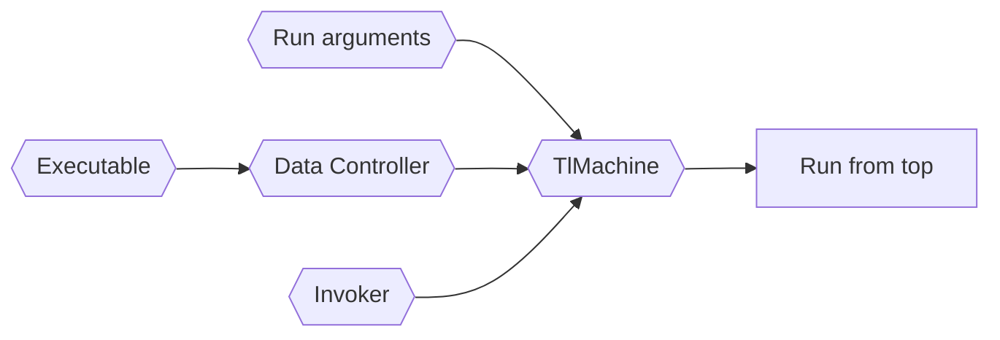
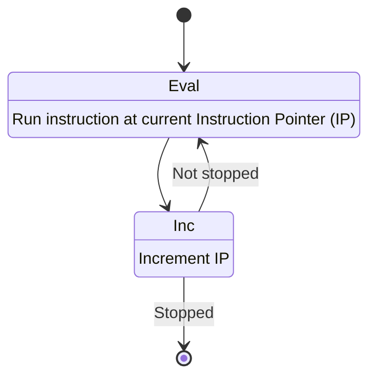
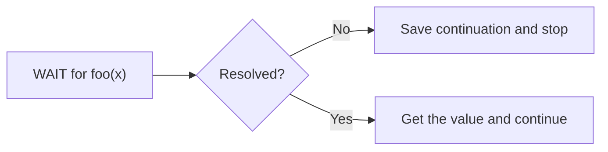
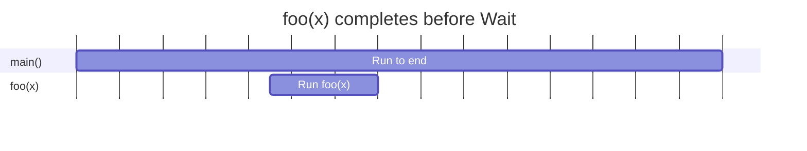
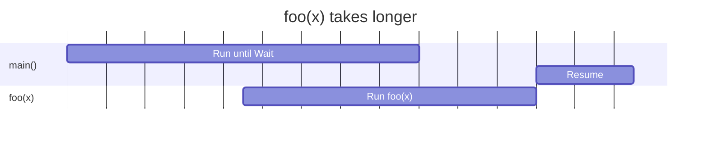

# Run

The (static) executable is run by the "TlMachine" class, using the previously
loaded configuration to create the VM.




## Overview

[Next: Start Top Level Thread](#start-top-level-thread)

Relevant functions & classes:
- `TlMachine` -- [hark_lang/machine/machine.py][machine]
- `Executable` -- [hark_lang/machine/executable.py][executable]
- `Controller` -- [hark_lang/machine/controller.py][controller]
- `Invoker` -- [hark_lang/executor/thread.py][thread]
- `Instruction` -- [hark_lang/machine/instructionset.py][instructionset] and [hark_lang/machine/instruction.py][instruction]

Vaguely speaking, "running" a program follows this logic:



To run the executable, the VM simply executes instructions until it cannot
anymore. Reasons it may stop:
- returning from the entrypoint function
- waiting for another thread to finish

Machine instructions can do several things:
- change the instruction pointer (control flow -- branches, jumps)
- push/pop the data stack
- halt the machine (e.g. to wait for a thread)
- perform actions with external side effects (new thread, write to stdout)

**Note**: Next we will go through some bytecode. Each instruction is defined in
[instructionset.py][instructionset] and implemented in [machine.py][machine].


## Start Top Level Thread

[Prev: Overview](#overview) \
[Next: ](#compute)

The Invoker instance calls `TlMachine.run` is to begin execution at `main`:

```
 | ;; #3:main:
 |   28 | PUSHV    1
 |   29 | PUSHB    compute
 |   30 | CALL     1
 |   31 | RETURN
```

Instructions:

1. `PUSHV 1` -- push the literal value `1` (integer 1) onto the data stack.

2. `PUSHB compute` -- push the value bound to `compute` onto the stack (in this
   case, the compute function).
   
3. `CALL 1` -- call a function with one argument. The top value on the stack is
    the function, and subsequent values are arguments.

4. `RETURN` -- (after `compute` returns) return from the function, ending the
   program in this case.

The `CALL` instruction creates a new **Activation Record** (like a stack frame)
and sets the IP to the location of `compute`.


## Compute

[Prev: Top Level](#start-top-level-thread) \
[Next: New Thread](#new-thread)

Now we evaluate `compute(1)`:

```
 | ;; #2:compute:
 |   10 | BIND     x
 |   11 | POP
 |   12 | PUSHB    x
 |   13 | PUSHB    foo
 |   14 | ACALL    1
 |   15 | BIND     a
 |   16 | POP
 |   17 | PUSHB    x
 |   18 | PUSHB    bar
 |   19 | CALL     1
 |   20 | BIND     b
 |   21 | POP
 |   22 | PUSHB    b
 |   23 | PUSHB    a
 |   24 | WAIT     0
 |   25 | PUSHB    +
 |   26 | CALL     2
 |   27 | RETURN
```

Interesting steps:


- `BIND x` -- bind the value on the top of the stack (without popping it) to
  `x`.

- `ACALL 1` -- call a function asynchronously with one argument. Again, the top
  value on the stack is the function (`foo`), and subsequent values are
  arguments. This uses the Invoker to start a new thread with the given function
  and arguments.

- `BIND a` -- bind the ACALL result to `a` (it will be a Future object). 

- `WAIT 0` -- wait for the top object on the stack to resolve (assuming it is a
  Future).
  


The simple "Yes" case can be visualised:



In this case, `foo(x)` finishes in the time it takes Thread 0 to run the 10
instructions between `ACALL` and `WAIT`.

Alternatively:



In this case, `foo(x)` takes longer and Thread 0 waits for it to continue. While
waiting, the underlying Python thread is killed.

Each Future has a list of "continuations", which are records of threads which
can be picked up and resumed at a later time. When the Future does resolve, it
can then use the Invoker to resume each thread.


## New Thread

[Prev: Compute](#compute) \
[Next: Finish](#finish)

`ACALL` creates a thread context for `foo(x)` - data stack, future and IP - and
uses the Invoker to start the thread.

```
 | ;; #F:foo:
 |    0 | PUSHB    foo
 |    1 | CALL     1
 |    2 | RETURN
```

`CALL 1` pops `foo` and one argument from the stack, and then calls `foo`
directly (after converting the argument to a Python type). The result is
converted to a Hark time and pushed onto the stack as the return value.

The Future associated with this thread is then resolved to that value, and any
waiting threads are resumed.


## Finish

[Prev: New Thread](#new-thread)

Once `foo(x)` has finished, and `compute(1)` is ready to `RETURN`, it retrieves
the caller IP from its activation record, and simply jumps there. The activation
record is deleted.

Finally, we return from `main()` -- all threads have "finished", and the result
is returned to the CLI to be printed.

The end. Here's a spaceship.

```
                     `. ___
                    __,' __`.                _..----....____
        __...--.'``;.   ,.   ;``--..__     .'    ,-._    _.-'
  _..-''-------'   `'   `'   `'     O ``-''._   (,;') _,'
,'________________                          \`-._`-','
 `._              ```````````------...___   '-.._'-:
    ```--.._      ,.                     ````--...__\-.
            `.--. `-`                       ____    |  |`
              `. `.                       ,'`````.  ;  ;`
                `._`.        __________   `.      \'__/`
                   `-:._____/______/___/____`.     \  `
                               |       `._    `.    \
                               `._________`-.   `.   `.___
                                             SSt  `------'`
```

<!-- --- -->

[instruction]: https://github.com/condense9/hark-lang/blob/master/src/hark_lang/machine/instruction.py
[instructionset]: https://github.com/condense9/hark-lang/blob/master/src/hark_lang/machine/instructionset.py
[machine]: https://github.com/condense9/hark-lang/blob/master/src/hark_lang/machine/machine.py
[controller]: https://github.com/condense9/hark-lang/blob/master/src/hark_lang/machine/controller.py
[executable]: https://github.com/condense9/hark-lang/blob/master/src/hark_lang/machine/executable.py
[thread]: https://github.com/condense9/hark-lang/blob/master/src/hark_lang/executor/thread.py
