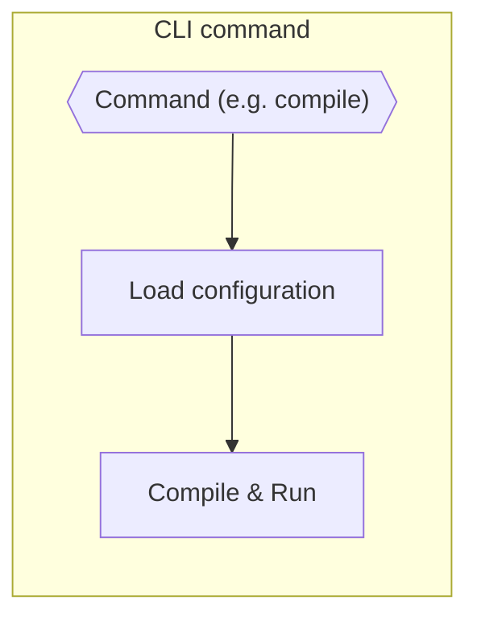
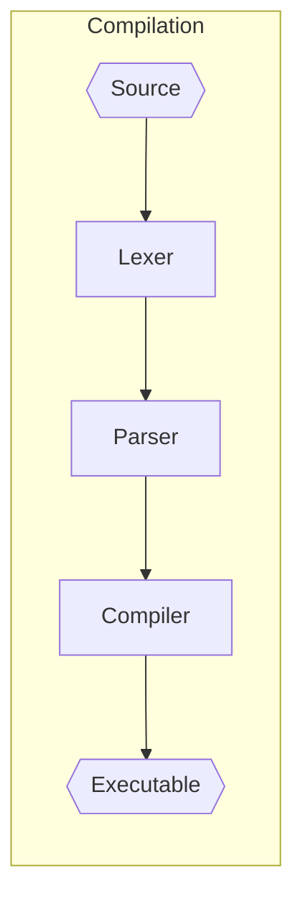
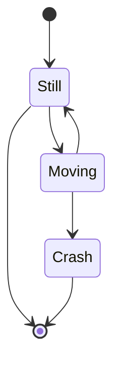
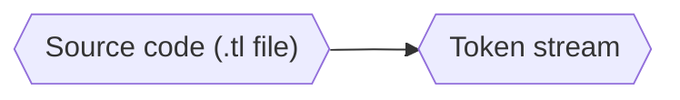
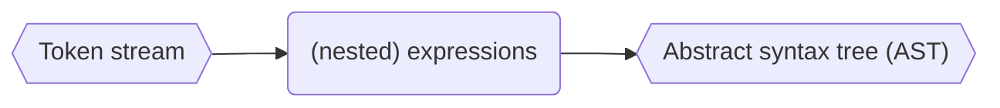
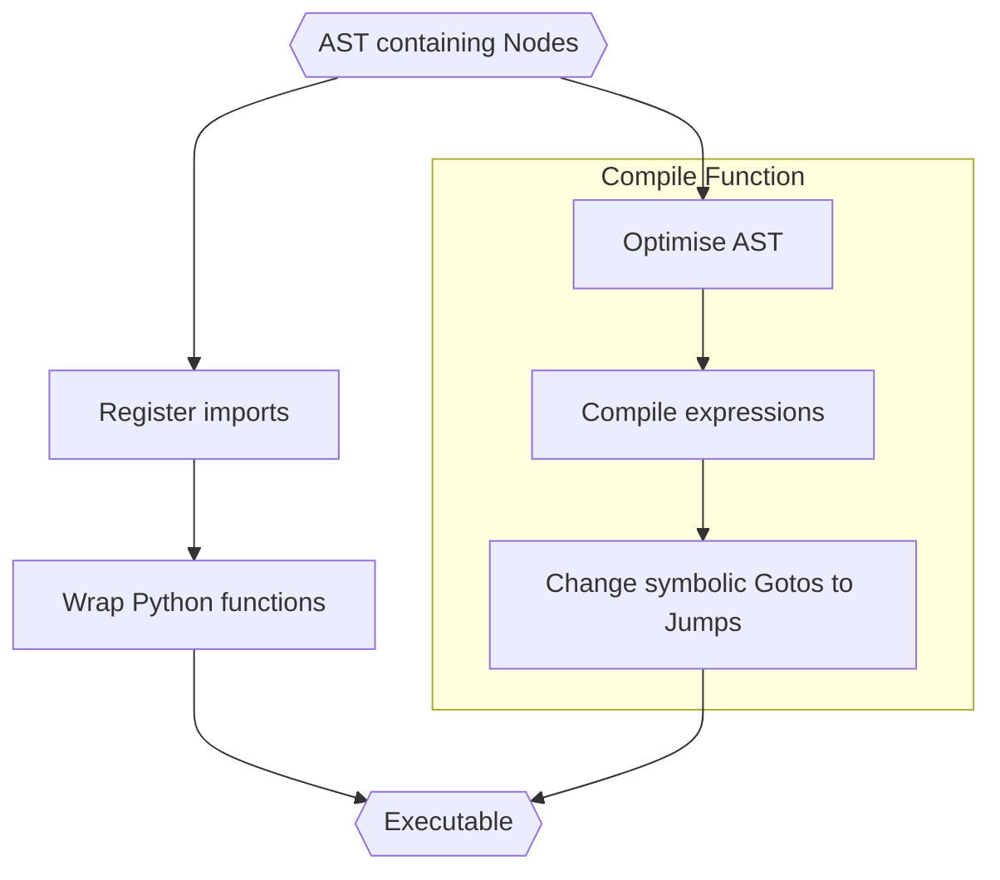
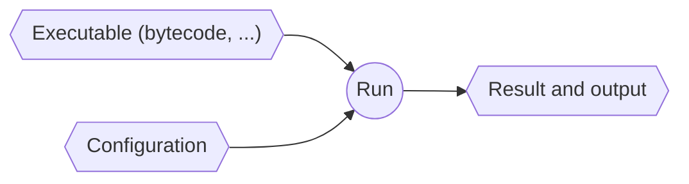
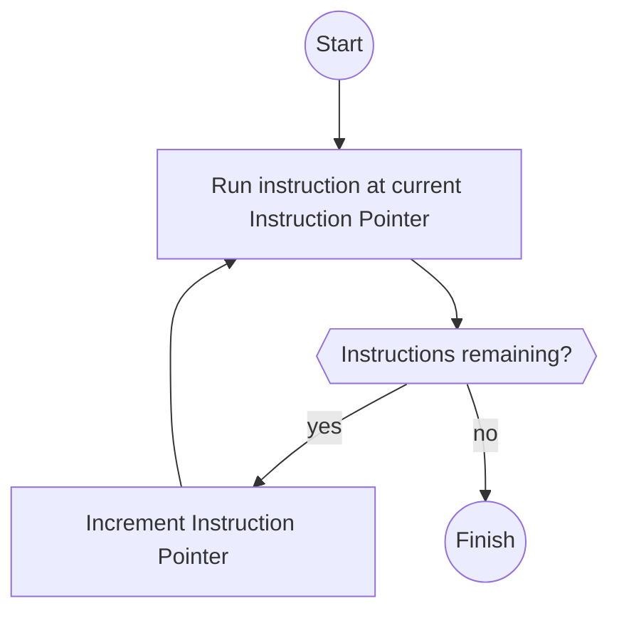

# From Source to Success

We'll start our journey by exploring the process of going from Teal source code
to successfully running a multi-thread process in AWS.

Here's our source:

```javascript
// service.tl
import(foo, pysrc, 1);

fn bar(x) {
  x + 1
}

fn compute(x) {
  a = async foo(x);
  b = bar(x);
  await a + b;
}

fn main() {
  compute(1)
}
```

Features
- one imported Python function, `foo`
- two Teal functions, `bar` and `compute`
- each function takes 1 argument (assumed to be an `int`)
- `foo` is called asynchronously (new thread)
- `bar(x)` is evaluated in the current thread
- `a` is waited for
- the sum `foo(x) + bar(x)` is returned


## Overview

So what happens when we run `teal service.tl`? First, the Teal CLI reads the
command, reads configuration and dispatches the handler.



Then, the source code gets compiled:



Then it's run.



We'll look at each step in more detail now.


## Configuration

[Next: Lex](#lex)

Relevant functions & classes:
- `dispatch` -- [teal_lang/cli/main.py][main]
- `load` -- [teal_lang/config.py][config]
- `ProjectConfig` -- [teal_lang/config_classes.py][config_classes]
- `InstanceConfig` -- [teal_lang/config_classes.py][config_classes]

Before anything, the Teal CLI loads configuration from `teal.toml` and from the
command-line arguments.

Particularly:
- the `-c` flag, which sets the concurrency mode (Python threads by default)
- the `-s` flag, which sets the storage mode (in-memory by default)
- the `-f` flag, which sets the function to run (`main` by default)

Both are required to create the Teal VM.


## Lex

[Prev: Configuration](#configuration) \
[Next: Parse](#parse)

In this step, the Teal source code is transformed into a stream of "tokens"
representing valid pieces of syntax (e.g. numbers, identifiers, keywords).



Relevant functions & classes:
- `compile_file` -- [teal_lang/load.py][load]
- `tl_parse` -- [teal_lang/teal_parser/parser.py][parser]
- `TealLexer` -- [teal_lang/teal_parser/parser.py][parser]

To see what the token stream looks like, load the file with the `DEBUG_LEX`
environment variable set:

```shell
$ DEBUG_LEX=1 teal service.tl

ID         : import
(          :
ID         : foo
,          :
ID         : pysrc
,          :
NUMBER     : 1
)          :
TERM       : ;
FN         : fn
ID         : bar
(          :
ID         : x
... etc
```

Note:
- each token has a "type" (e.g. `ID` -- Identifier, or `FN` -- the "define
  function" keyword)
- some tokens have a "value" (e.g. `foo`)
- punctuation is syntax (e.g. `(`)
- some literals have their own tokens (e.g. `"true"` -> `TRUE`)

The lexing is done by [Sly][sly].


## Parse

[Prev: Lex](#lex) \
[Next: Compile](#compile)

Here, the token stream is converted into a tree-like data-structure representing
valid Teal program structure.



Relevant functions & classes:
- `tl_parse` -- [teal_lang/teal_parser/parser.py][parser]
- `TealParser` -- [teal_lang/teal_parser/parser.py][parser]
- `Node` -- [teal_lang/teal_parser/nodes.py][nodes]

> We don't have a good visualisation of the Teal AST yet :(. Make one and submit
> a PR for [Issue #14](https://github.com/condense9/teal-lang/issues/14)!

What does **valid program structure** mean? Teal programs are sequences of
"expressions". Everything is an expression, and expressions may contain other
expressions.

The AST is made up of `Node` instances, which represent expressions.

For example, the token `TRUE` is parsed as an expression (`expr`) into a Node
subclass called `N_Literal`, which holds a literal value (Python `True` in this
case).

```python
@_("TRUE")
def expr(self, p):
    return N(self, p, n.N_Literal, True)
```

*Note*: `N` is a factory function to construct a Node with debug symbols taken
from the parser.

Another example. The sequence of tokens representing an if-expression (yup, `if`
is also an `expr`) are parsed into a Node to represent it.

```python
@_("IF expr block_expr TERM rest_if")
def expr(self, p):
    return N(self, p, n.N_If, p.expr, p.block_expr, p.rest_if)
```

Here, `block_expr` and `rest_if` are parser items with rules expressed
elsewhere.

This is how a function call, e.g. `foo(x)`, is parsed:

```python
@_("ID '(' arglist ')'")
def expr(self, p):
    identifier = N(self, p, n.N_Id, p.ID)
    return N(self, p, n.N_Call, identifier, p.arglist)
```

- `ID`: `foo`
- `'('`: a literal opening bracket
- `arglist`: a parser rule to parse a list of arguments (defined elsewhere)
- `')'`: a literal closing bracket

Check the [Sly][sly] docs for more details.

**Error handling**: The parser is currently fragile - any error causes immediate
failure. A more conventional approach would be to attempt to continue and
present all errors at the end.


## Compile

[Prev: Parse](#parse) \
[Next: Run](#run)

The AST is now compiled into an Executable -- a multi-step process.



Relevant functions & classes:
- `Node` -- [teal_lang/teal_parser/nodes.py][nodes]
- `CompileToplevel` -- [teal_lang/teal_compiler/compiler.py][compiler]
- `optimise_block` -- [teal_lang/teal_compiler/compiler.py][compiler]
- `replace_gotos` -- [teal_lang/teal_compiler/compiler.py][compiler]
- `Executable` -- [teal_lang/machine/executable.py][executable]
- `Instruction` -- [teal_lang/machine/instructionset.py][instructionset] and [teal_lang/machine/instruction.py][instruction]
- `TlType` -- [teal_lang/machine/types.py][types]

> Currently, each Teal function is compiled **individually**. So there is no
> opportunity for cross-function optimisation.

First, let's briefly look at the (simplified) Executable class to know where
we're going.

```python
@dataclass
class Executable:
    code: List[Instruction]
    bindings: Dict[str, TlType]
    locations: Dict[str, int]
    attributes: dict
```

**code**: All of the executable machine instructions.

**bindings**: A map of string names (identifiers) to either teal functions or
imported Python functions.

**locations**: Lookup-table of Teal function locations in **code**. 

**attributes**: (not used yet) Attributes of Teal functions for compiler/runtime
behaviour configuration.

Here's the result of compiling `service.tl`.

```shell
$ teal asm service.tl

BYTECODE:
 /
 | ;; #F:foo:
 |    0 | PUSHB    foo
 |    1 | CALL     1
 |    2 | RETURN
 | ;; #1:bar:
 |    3 | BIND     x
 |    4 | POP
 |    5 | PUSHV    1
 |    6 | PUSHB    x
 |    7 | PUSHB    +
 |    8 | CALL     2
 |    9 | RETURN
 | ;; #2:compute:
 |   10 | BIND     x
 |   11 | POP
 |   12 | PUSHB    x
 |   13 | PUSHB    foo
 |   14 | ACALL    1
 |   15 | BIND     a
 |   16 | POP
 |   17 | PUSHB    x
 |   18 | PUSHB    bar
 |   19 | CALL     1
 |   20 | BIND     b
 |   21 | POP
 |   22 | PUSHB    b
 |   23 | PUSHB    a
 |   24 | WAIT     0
 |   25 | PUSHB    +
 |   26 | CALL     2
 |   27 | RETURN
 | ;; #3:main:
 |   28 | PUSHV    1
 |   29 | PUSHB    compute
 |   30 | CALL     1
 |   31 | RETURN
 \

BINDINGS:

 NAME        VALUE
 foo ....... <TlForeignPtr pysrc.foo>
 bar ....... <TlFunctionPtr #1:bar>
 compute ... <TlFunctionPtr #2:compute>
 main ...... <TlFunctionPtr #3:main>
```

### Register imports

Any `import` expressions at file top-level are saved as named bindings in the
final executable. They're also wrapped in Teal functions so that they can be
called just like Teal functions (`#F:foo` above). Currently this wrapped version
is only needed when calling a Python function asychronously -- usually, the
Python function is called directly.

### Compile Functions

Each top-level definition is compiled into a "body" of instructions and a named
binding. The final executable code is created by simply concatenating all of the
bodies together and saving the locations by name (e.g. `bar -> #1:bar ->
code[3]` above).

### Optimise AST

Currently [tail-recursion optimisation][tailcalls] is implemented, which makes
recursive functions significantly faster because no activation record (stack
frame) is created in the "recur" call.

### Compile Expressions

Each node (representing an expression) in the tree must be converted into a
*sequence* of VM instructions (bytecode).

Examples of compiling expressions:
- convert literal Python types to Teal types
- convert `N_If` (the if-expression Node) into linear instructions and
  conditional Jumps

For example, a literal value is simply pushed onto the data stack:

```python
@compile_expr.register
def _(self, n: nodes.N_Literal):
    val = mt.to_teal_type(n.value)
    return [mi.PushV.from_node(n, val)]
```

*`mi` is the machine instruction module, and `mt` is machine types.*

The `from_node` constructor copies node debug data into the instruction so that
tracebacks can be created.

A function call is more interesting as the arguments have to be evaluated first.

```python
def _compile_call(self, n: nodes.N_Call, is_async: bool) -> List[Instruction]:
    arg_code = flatten(self.compile_expr(arg) for arg in n.args)
    instr = mi.ACall if is_async else mi.Call
    return (
        arg_code
        + self.compile_expr(n.fn)
        + [instr.from_node(n, mt.TlInt(len(n.args)))]
    )
```

`arg_code` contains a list of instructions to evaluate each of the function
arguments, which is simply prefixed to the function call instruction.

Note that `n.fn`, the function identifier, is also compiled -- the Call (or
ACall) instruction requires the identifier to be on the stack.


## Run

[Prev: Compile](#compile)

The (static) executable is run, using the previously loaded configuration to
create the VM.



Relevant functions & classes:
- `TlMachine` -- [teal_lang/machine/machine.py][machine]
- `Executable` -- [teal_lang/machine/executable.py][executable]
- `Controller` -- [teal_lang/machine/controller.py][controller]
- `Instruction` -- [teal_lang/machine/instructionset.py][instructionset] and [teal_lang/machine/instruction.py][instruction]

The machine run logic looks something like:



Sidenote: wow, that drawing is pretty terrible!

Machine instructions can do several things:
- change the instruction pointer (control-flow)
- push/pop the data stack
- halt the machine (e.g. to wait for a thread)
- perform actions with external side effects (new thread, write to stdout)


### Example Bytecode

Here's an excerpt from the bytecode produced for our `service.tl`:

```
...
 |   10 | BIND     x
 |   11 | POP
 |   12 | PUSHB    x
 |   13 | PUSHB    foo
 |   14 | ACALL    1
 |   15 | BIND     a
...
```

Steps:

1. `BIND x` - take the top value off the stack and (locally) bind it to the
   symbol named "x".
   
2. `POP` - remove the top value from the stack (left behind by `BIND`)

3. `PUSHB x` - Push the value bound to `x` onto the stack. *Yes*: there's an
   obvious opportunity for compile-time optimisation here. The sub-optimal code
   results from the piecemeal context-free compilation process.

4. `PUSHB foo` - Push the value bound to `foo` (i.e., `<TlForeignPtr
   pysrc.foo>`) onto the stack
   
5. `ACALL 1` - Call a function asynchronously with one argument. The top value
   on the stack is popped and used to find the function, and the next (one)
   parameter is popped and passed to the function.

6. `BIND a` - Bind the top value on the stack (the function return value) to the
   symbol named "a"
   
See [teal_lang/machine/instructionset.py][instructionset] for the instruction
set and [teal_lang/machine/machine.py][machine] for implementation.


<!-- --- -->

[sly]: https://github.com/dabeaz/sly
[tailcalls]: https://wiki.c2.com/?TailRecursion

[main]: https://github.com/condense9/teal-lang/blob/master/src/teal_lang/cli/main.py
[config]: https://github.com/condense9/teal-lang/blob/master/src/teal_lang/config.py
[config_classes]: https://github.com/condense9/teal-lang/blob/master/src/teal_lang/config_classes.py
[load]: https://github.com/condense9/teal-lang/blob/master/src/teal_lang/load.py
[parser]: https://github.com/condense9/teal-lang/blob/master/src/teal_lang/teal_parser/parser.py
[nodes]: https://github.com/condense9/teal-lang/blob/master/src/teal_lang/teal_parser/nodes.py
[compiler]: https://github.com/condense9/teal-lang/blob/master/src/teal_lang/teal_compiler/compiler.py
[executable]: https://github.com/condense9/teal-lang/blob/master/src/teal_lang/machine/executable.py
[instruction]: https://github.com/condense9/teal-lang/blob/master/src/teal_lang/machine/instruction.py
[instructionset]: https://github.com/condense9/teal-lang/blob/master/src/teal_lang/machine/instructionset.py
[types]: https://github.com/condense9/teal-lang/blob/master/src/teal_lang/machine/types.py
[machine]: https://github.com/condense9/teal-lang/blob/master/src/teal_lang/machine/machine.py
[controller]: https://github.com/condense9/teal-lang/blob/master/src/teal_lang/machine/controller.py
